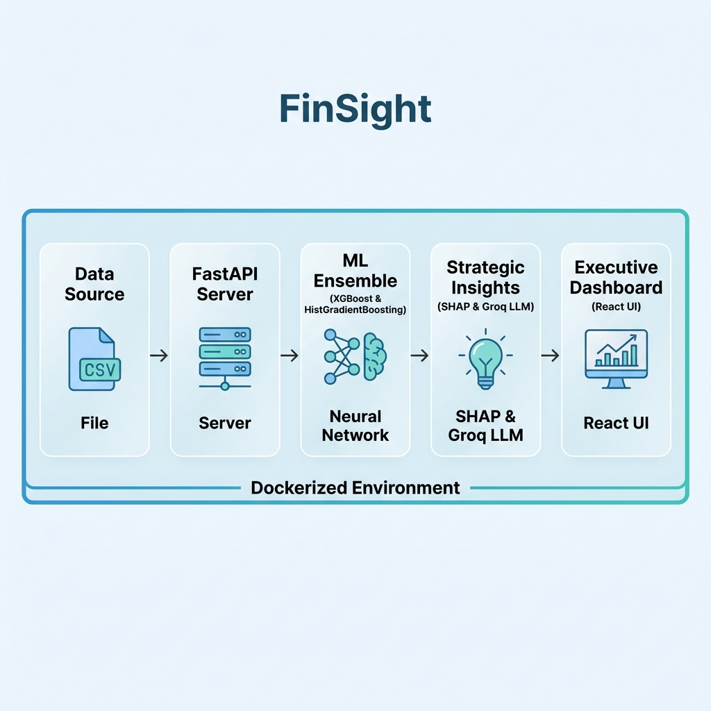

# FinSight — Enterprise Churn Intelligence for Fintech Partners

<div align="center">

> **Transforming raw transactional logs into a defensible revenue protection strategy.**

[](https://www.python.org/)
[](https://fastapi.tiangolo.com/)
[](https://react.dev/)
[](https://vitejs.dev/)
[](https://xgboost.readthedocs.io/)
[](https://groq.com/)
[](https://finsight-frontend-r0a8.onrender.com/)

</div>

---

## Closing the Fintech "Revenue Leak"

### 1. The Problem: The "Blind Spot" in High-Velocity Fintech
Fintech partners today are "data rich but insight poor." While they capture millions of event logs (UPI, Tax, Wealth transactions), their retention strategies are often reactive.
- **The Gap**: Most models treat all users as a single monolith, missing the subtle behavioral decay that precedes a total exit.
- **The Cost**: In "clean" portfolios (like Tax data), standard models often report **0% risk**, failing to detect the "silent churn" that costs platforms billions.

### 2. The Solution: FinSight Intelligence Engine
FinSight is an **Autonomous Analytics Pipeline** that does more than just predict; it **Prescribes**.
- **Domain-Agnostic Calibration**: Our engine uses a fuzzy-logic mapping layer that autonomously adapts its RFM strategy based on dataset sparsity (e.g., daily UPI vs. quarterly Tax credits).
- **Adaptive Risk Sensitivity**: If absolute churn is low, the engine pivots to **"Warning Cohort" identification**, targeting the top 20% at-risk users before they lapse.
- **Revenue-Weighted RAR**: We calculate **Revenue at Risk (RAR)** by weighting churn probability against Monetary Velocity, ensuring the Board focuses on the most valuable capital protection.

### 3. The Approach: Why we rejected "Black Boxes"
We considered Deep Learning (RNN/LSTMs) but **rejected them** because they lack the transparency required for financial auditing.
- **Why Ensemble (RF + XGB)?**: We use a Random Forest for baseline stability and XGBoost for catching non-linear edge cases.
- **Why SHAP Interaction?**: Standard feature importance is shallow. FinSight uses **SHAP Dependence Analysis** to show how features interact (e.g., how high "Spend" combined with "Low Tenure" creates a specific high-risk persona).
- **The "Truth" Guard**: Every prediction is backed by a **Model Evidence %**, ensuring that PMs know whether a strategy is a statistical certainty or a weak correlation.
- **Strategic Personas**: We translate abstract clusters into **Strategic Personas** (e.g., *The Loyal Giant*, *The Fading Star*) with domain-specific explanations for non-technical stakeholders.


---

## Architecture: Data to Decisions



---

## Features

### 1. Groq-Powered Strategic Layer (Llama 3.3)
FinSight integrates the **Groq API** to bridge the gap between "Data Science" and "Business Strategy."
- **Automated Hypotheses**: The system feeds ML-derived SHAP values into Llama 3.3 to generate exactly 3 testable business hypotheses with quantified expected impact.
- **ROI Explainer**: Every What-If simulation is backed by an AI-generated explanation, telling Product Managers *why* a specific intervention is (or isn't) profitable.

### 2. Multi-Domain Intelligence
Pre-calibrated for high-impact sectors:
- **UPI & Fintech**: Analyzes transaction failure rates, VPA diversity, and wallet-share velocity.
- **Tax & Compliance**: Specialized features for Form 26AS, TDS compliance rates, and income-head diversity.
- **Banking**: Monitors balance stability, credit score drift, and multi-product engagement.

### 3. What-If Simulation 2.0
An interactive sandbox where product managers can simulate behavioral changes (e.g., *"What if we reduce UPI failure rates by 15%?"*) and immediately see the projected **Revenue Saved** and **ROI**.

### 4. Explainable AI (SHAP)
We rejected "Black Box" models. Every prediction includes a **Feature Impact Breakdown**, showing the exact behavioral drivers (e.g., "Frequency Drop" or "High Recency") causing the risk.

### 5. Live Drift Monitoring
Integrates **KS-Test (Kolmogorov-Smirnov)** to detect distribution shifts between historical training data and live transactional streams. If user behavior shifts (e.g., due to market changes), the engine flags it immediately.

---

## How We Process Data

### 1. Ingestion & Categorization
FinSight uses a **Schema-Agnostic Mapping Engine**. When you upload a CSV, the engine:
1.  **Detects Domain**: Autonomously identifies if the data is Retail, Banking, UPI, or Tax based on column signatures.
2.  **Categorizes Features**: Maps raw columns to core behavioral dimensions: **Recency, Frequency, Monetary, and IPI (Inter-Purchase Interval)**.
3.  **Handles Sparsity**: Automatically adjusts lookback windows and velocity floors to prevent skewed metrics in low-frequency datasets (like Tax).

### 2. The AI Pipeline
- **Ensemble Model**: A stacked classifier combining **Random Forest** (for baseline stability), **XGBoost** (for non-linear edge cases), and **HistGradientBoosting**.
- **Calibration**: Uses **Isotonic Calibration** to ensure probabilities are true-to-life (0% to 100% range) rather than squashed scores.
- **Threshold Optimization**: Instead of a naive 0.5 threshold, we use **Business-Utility Optimization** to maximize the F1-score and balance False Positives/Negatives based on intervention costs.

---

## Setup & Implementation

### 1. Quick Start (Docker)
```bash
git clone https://github.com/RiyanshiVerma-11/FinSight.git
cd FinSight
docker-compose up --build
```

### 2. Environment Variables
To enable the LLM strategic layer, add your Groq key to a `.env` file:
```env
GROQ_API_KEY=your_groq_api_key_here
```

---

## The 30-Day Roadmap: What's Next?
If we had another month, these are the **High-ROI** features we would ship first:

1. **Live Transactional Streams (Kafka/RabbitMQ)**: 
   - Moving from batch CSV uploads to a real-time WebSocket firehose.
   - **Why?** To enable "Instant Nudges" the second a high-value user's IPI (Inter-Purchase Interval) deviates from their historical norm.

2. **Automated A/B Test Orchestrator**:
   - A persistent database to track "Approved Strategies" and automatically measure their actual churn-reduction performance against the model's prediction.
   - **Why?** To create a self-healing ROI feedback loop.

3. **Drift-Triggered Auto-Retraining**:
   - Integrating the current KS-Test (Drift Detection) into an automated training trigger.
   - **Why?** To ensure the model remains "Google-grade" even as market behavior shifts.

---

## Links & Resources
- **Live Dashboard**: [FinSight Portal](https://finsight-frontend-r0a8.onrender.com/)
- **API Documentation**: [FastAPI Docs](https://finsight-backend-r0a8.onrender.com/docs)

### Sample Datasets: Test the Engine
FinSight is domain-agnostic. You can test the intelligence pipeline with any transactional or summary dataset.

#### 1. Retail & E-commerce (Transactional)
*   [Online Retail II (2009-2010)](https://www.kaggle.com/datasets/jillwang87/online-retail-ii?select=online_retail_09_10.csv) | [2010-2011](https://www.kaggle.com/datasets/jillwang87/online-retail-ii?select=online_retail_10_11.csv)
*   *Detection Signal*: Looks for `Invoice`, `StockCode`, and `Quantity`.

#### 2. Banking & Fintech (Summary/Churn)
*   [Bank Customer Churn Prediction](https://www.kaggle.com/datasets/marslinoedward/bank-customer-churn-prediction?select=Churn_Modelling.csv)
*   *Detection Signal*: Looks for `Exited`, `CreditScore`, and `Tenure`.

#### 3. UPI & Tax (Internal Demo)
*   Located in: `backend/datasets/`
*   Includes **UPI Transactional logs** and **Tax/Income credits** (Form 26AS style).
*   *Detection Signal*: Looks for `VPA`, `Txn ID`, `PAN`, or `TDS Amount`.

---

## License
MIT © 2026 Riyanshi Verma

<div align="center">

**FinSight** · Intelligent Retention for a Data-Driven Future.

</div>
