# FinSight v3.2 — Enterprise Churn Intelligence & Retention ROI

<div align="center">

> **Predict · Explain · Intervene · Protect Revenue**
>
> An enterprise-grade analytics engine that transforms raw fintech transaction data into actionable churn intelligence — featuring real-time lifecycle monitoring, product-risk correlation, and data-driven strategic playbooks.

[](https://www.python.org/)
[](https://fastapi.tiangolo.com/)
[](https://react.dev/)
[](https://vitejs.dev/)
[](https://xgboost.readthedocs.io/)
[](https://shap.readthedocs.io/)
[](https://docs.docker.com/)
[](LICENSE)
[](https://finsight-frontend-r0a8.onrender.com/)

</div>

---

## Strategic Value

| Dimension | Standard Analytics | **FinSight v3.2 (Enterprise)** |
|-----------|---------------------------|--------------------------|
| **Lifecycle** | Static user counts | **Dynamic Stages (New, Active, Early Churn)** |
| **Product Risk** | Sales volume only | **Product-to-Churn Correlation Mapping** |
| **Strategy** | General insights | **Testable Hypotheses + Expected ROI Lift** |
| **Prediction** | Binary churn (Yes/No) | **Probability + Revenue-Weighted Risk** |
| **Explainability**| Static charts | **Per-user Local SHAP + Searchable Action List**|
| **Reporting** | CSV Export | **"Board Meeting" PDF Export (Synced Metrics)** |

---

## Feature Catalogue

### 1. Lifecycle Onboarding Intelligence *(new)*
The system identifies critical transition points in the user journey:
- **Onboarding List**: A prioritized view of users in the 'New' phase who haven't hit the 2nd purchase threshold.
- **Paginated Search**: Full-screen modal with search functionality to investigate high-risk individuals.
- **Retention Nudges**: Direct action buttons to trigger targeted re-engagement for onboarding users.

### 2. Product-Risk Correlation Analysis *(new)*
Moves beyond simple sales volume to identify which products actually drive churn:
- **Risk Drivers**: Identifies products correlated with high churn (e.g., "Problematic" service tiers).
- **Retention Anchors**: Highlights products that keep users loyal.
- **Priority Mix**: Dynamic table sorting products by their absolute impact on churn probability.

### 3. Testable Hypothesis Playbook *(new)*
Replaces generic AI advice with scientifically grounded, testable strategies:
- **Expected Lift**: Every hypothesis calculates its own projected recovery percentage dynamically based on the specific statistical gaps between your retained and churned cohorts.
- **Experimental Guardrails**: Defines the specific "Test" to run (e.g., A/B testing Fee Waivers vs. VIP Support).
- **Impact Badges**: Visual categorization of strategies based on potential revenue recovery.

### 4. Enterprise-Grade Dashboard Sync
Ensures total data consistency for high-stakes stakeholder presentations:
- **Synchronized Metrics**: Every gauge and footer reflects the same calibrated **85.1% ROC-AUC** score.
- **Revenue-Weighted Risk**: Aggregated risk is weighted by user monetary value, preventing low-value "ghost" users from skewing boardroom decisions.
- **Data Health Check**: Real-time monitoring of dataset completeness and feature drift.

### 5. "Board Meeting" Export Engine
Generate executive-ready reports with one click:
- **PDF Export**: Capture the entire app state (Executive View + Metrics) into a professional document.
- **Persona Classification**: Communicates risk using professional fintech personas (e.g., "The Fading Star", "The Loyal Giant").

### 6. Per-User Local SHAP & Model Evidence
- **Interactive Modals**: Click any user row to see exactly why the model flagged them.
- **Global Feature Interaction**: Interactive plots showing how metrics like $Amount × Tenure$ drive churn probability.
- **Model Transparency**: Real-time display of cross-validation F1-scores and model versioning.

---

## Architecture Flow

```mermaid
graph TB
  classDef frontend fill:#eef2ff,stroke:#6366f1,stroke-width:2px
  classDef backend fill:#f0fdf4,stroke:#16a34a,stroke-width:2px
  classDef engine fill:#fdf4ff,stroke:#9333ea,stroke-width:2px
  classDef infra fill:#fff7ed,stroke:#ea580c,stroke-width:2px

  subgraph FE ["Frontend (React 19 + Vite 8)"]
    TABS["Tabbed Navigation (Exec, Overview, ML, Sim, Users)"]
    TOUR["Joyride Onboarding Tour"]
    PDF["Board Meeting PDF Export"]
    WI["What-If + ROI Simulator"]
    UT["Priority-Ranked User Table"]
    SM["SHAP Waterfall Modal"]
  end

  subgraph API ["Backend API (FastAPI)"]
    AN["POST /analyze"]
    AL["GET /analyze-local"]
    US["GET /user-shap/{id}"]
    WF["POST /whatif"]
    LH["GET /llm-hypotheses"]
    WS["WS /stream"]
    MV["GET /models"]
  end

  subgraph AE ["Analytics Engine"]
    RFM["Dynamic RFM + IPI"]
    ML["Random Forest / XGBoost Ensemble"]
    SH["SHAP TreeExplainer"]
    ROI["Retention ROI Logic"]
    COH["Cohort Analysis"]
    LTV["Predicted LTV"]
  end

  subgraph SVC ["Services"]
    LLM["LLM Engine (Groq/Llama3)"]
    DG["Fintech Data Generator"]
    MVM["Model Version Manager"]
  end

  FE -->|REST + WS| API
  API --> AE
  AE --> SVC

  class FE,TABS,TOUR,PDF,WI,UT,SM frontend
  class API,AN,AL,US,WF,LH,WS,MV backend
  class AE,RFM,ML,SH,ROI,COH,LTV engine
  class SVC,LLM,DG,MVM infra
```



---

## Tech Stack

| Layer | Technology | Purpose |
|-------|-----------|---------|
| **API** | FastAPI 0.104 | Async REST + WebSocket server |
| **Validation** | Pydantic v2 | Strict request/response schemas |
| **ML** | Scikit-learn 1.3, XGBoost 2.0 | Random Forest Churn Classification |
| **Explainability** | SHAP 0.44 | Global + local feature attribution |
| **Frontend** | React 19, Vite 8 | Tabbed SPA dashboard |
| **Onboarding** | React Joyride | Interactive user tour |
| **Reporting** | html2canvas, jsPDF | "Board Meeting" PDF generation |
| **LLM** | Groq API (Llama 3) | SHAP-linked AI hypotheses |
| **DevOps** | Docker Compose | Containerized orchestration |

---

## Getting Started

### Prerequisites
- Docker Desktop (Recommended)

### Option A — Docker (Quick Start)
```bash
git clone https://github.com/RiyanshiVerma-11/FinSight.git
cd FinSight
docker-compose up --build
```
| Service | URL |
|---------|-----|
| Dashboard | http://localhost:3000 |
| API | http://localhost:8000 |
| Documentation | http://localhost:8000/docs |

---

## Business Value

| Problem | FinSight Solution | Impact |
|---------|-----------------|-------------------|
| **Opaque Decisions** | SHAP Explainability | Auditable ML → Action chain |
| **Blind Campaigns** | ROI Calculator | Profitable vs Non-Profitable spend |
| **Hidden Churn** | Priority Score | Top 50 users to save TODAY |
| **Executive Disconnect**| Board Meeting Export | One-click C-suite reporting |
| **Complex UX** | Tabbed Interface | Reduced time-to-insight |

---

## Project Structure

```text
FinSight/
├── backend/
│   ├── main.py           # FastAPI entry point
│   ├── schemas.py        # Pydantic v2 data models
│   ├── requirements.txt  # Python dependencies
│   ├── Dockerfile        # Backend container config
│   ├── datasets/         # Pre-loaded fintech datasets
│   ├── models/           # Versioned ML model artifacts (.pkl)
│   ├── services/
│   │   ├── analytics.py     # RFM, Churn (RF), SHAP, LTV logic
│   │   ├── llm_engine.py    # Groq-powered hypothesis generator
│   │   └── data_generator.py # Real-time event stream logic
│   └── tests/            # Pytest suite (API & Analytics)
├── frontend/
│   ├── src/
│   │   ├── App.jsx          # Dashboard orchestrator & Tab logic
│   │   ├── index.css        # Design system & global styles
│   │   └── components/
│   │       ├── ExecutiveDashboard.jsx # PDF-exportable CEO view
│   │       ├── InterventionEngine.jsx # Action playbook engine
│   │       ├── WhatIfPanel.jsx      # ROI & Campaign simulator
│   │       ├── ShapModal.jsx       # User-level explainability
│   │       └── LiveTicker.jsx      # WebSocket event feed
│   ├── tests/               # Vitest & RTL component tests
│   ├── vite.config.js       # Vite build configuration
│   └── package.json         # Node.js dependencies
├── render.yaml           # Multi-service cloud deployment config
├── docker-compose.yml    # Local orchestration
└── README.md             # Project documentation
```

---

## License

MIT © 2026 Riyanshi Verma

<div align="center">

Built for Professional Fintech Partners · **FinSight v3.2**

</div>
