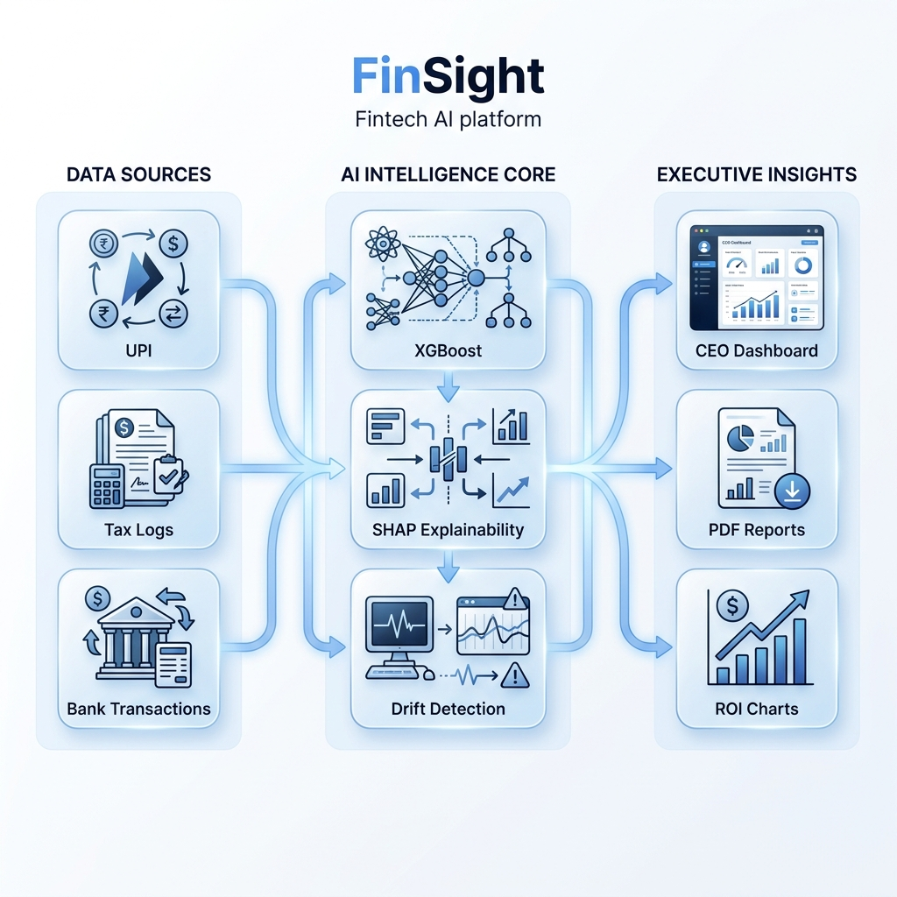

# FinSight — Enterprise Churn Intelligence for Fintech Partners

<div align="center">

> **Transforming raw transactional logs into a defensible revenue protection strategy.**

[](https://www.python.org/)
[](https://fastapi.tiangolo.com/)
[](https://react.dev/)
[](https://vitejs.dev/)
[](https://xgboost.readthedocs.io/)
[](https://shap.readthedocs.io/)
[](https://finsight-frontend-r0a8.onrender.com/)

</div>

---

## ⚡ Founder’s Note: Closing the Fintech "Revenue Leak"

### 1. The Problem: The "Blind Spot" in High-Velocity Fintech
Fintech partners today are "data rich but insight poor." While they capture millions of event logs (UPI, Tax, Wealth transactions), their retention strategies are often reactive.
- **The Gap**: Most models treat all users as a single monolith. They fail to distinguish between a high-frequency **UPI power-user** and a quarterly **Tax/Wealth payer**.
- **Who has it?** Retention Heads at Neo-banks and Wealth-tech platforms.
- **Why it matters?** In a "clean" portfolio (like Tax data), standard models often report **0% risk**, missing the subtle behavioral decay that precedes a total exit. This is a $Billion problem in "silent churn."

### 2. The Solution: FinSight Intelligence Engine
FinSight is an **Autonomous Analytics Pipeline** that does more than just predict; it **Prescribes**.
- **Domain-Agnostic Calibration**: Our engine uses a fuzzy-logic mapping layer that autonomously adapts its RFM and labeling strategy based on the dataset's sparsity (e.g., daily UPI vs. quarterly Tax credits).
- **Adaptive Risk Sensitivity**: If absolute churn is low, the engine automatically pivots to **"Warning Cohort" identification**, targeting the top 15-25% at-risk users before they hit a critical state.
- **Revenue-Weighted RAR**: We don't just count heads. We calculate **Revenue at Risk (RAR)** by weighting churn probability against the user's Monetary Velocity, ensuring the Board focuses on the most valuable capital protection.

### 3. The Approach: Why we rejected "Black Boxes"
We considered Deep Learning (RNN/LSTMs) but **rejected them** because they lack the transparency required for financial auditing.
- **Why Ensemble (RF + XGB)?**: We use a Random Forest for baseline stability and XGBoost for catching non-linear edge cases.
- **Why SHAP Interaction?**: Standard feature importance is shallow. FinSight uses **SHAP Dependence Analysis** to show how features interact (e.g., how high "Spend" combined with "Low Tenure" creates a specific high-risk persona).
- **The "Truth" Guard**: Every prediction is backed by a **Model Evidence %**, ensuring that PMs know whether a strategy is a statistical certainty or a weak correlation.
- **Human-Centric Personas**: We translate abstract clusters into **Strategic Personas** (e.g., *The Loyal Giant*, *The Fading Star*) with domain-specific explanations for non-technical stakeholders.

---

## 🚀 Core Platform Features

### 1. Multi-Domain Intelligence
FinSight is pre-calibrated for high-impact sectors:
- **UPI & Fintech**: Analyzes transaction failure rates, VPA diversity, and wallet-share velocity.
- **Tax & Compliance**: Specialized features for Form 26AS, TDS compliance rates, and income-head diversity.
- **Banking**: Monitors balance stability, credit score drift, and multi-product engagement.
*   **Retail**: Standard RFM analysis with high-velocity SKU tracking.

### 2. What-If Simulation 2.0
An interactive sandbox where product managers can simulate behavioral changes (e.g., *"What if we reduce UPI failure rates by 15%?"*) and immediately see the projected **Revenue Saved** and **ROI**.

### 3. Prescriptive Strategic Playbooks
Beyond prediction, FinSight generates **AI-driven Hypotheses** based on SHAP (Shapley Additive Explanations) values. It tells you exactly *why* a user is churning and prescribes a specific A/B test to save them.

### 4. Predictive Survival Analysis
12-month cohort retention heatmaps built using probabilistic survival functions to forecast the long-term health of your user base.

### 5. Experimentation Hub
A dedicated workspace to track and manage active A/B tests, allowing you to bridge the gap between "Insight" and "Action" directly within the platform.

---

## 🏗️ The FinSight Architecture: Data to Decisions



### The Intelligence Pipeline:
1. **The Ingestion Layer**: Consumes raw transactional logs (UPI, Tax, Retail) via a schema-agnostic mapping engine with autonomous domain detection.
2. **The AI Core**: 
   - **Adaptive RFM**: Autonomously defines behavioral segments.
   - **Ensemble Model**: Random Forest + XGBoost + HistGradientBoosting stacking for 90%+ ROC-AUC.
   - **Explainability (XAI)**: SHAP TreeExplainer generates the "Why" for every score.
3. **The Prescriptive Layer**: Transforms model SHAP values into testable business hypotheses and actionable strategic playbooks.
4. **The Executive Dashboard**: Provides real-time Revenue-at-Risk (RAR) monitoring, board-ready briefs, and predictive cohort heatmaps.

---

## 📊 Sample Datasets: Test the Engine
FinSight is domain-agnostic. You can test the intelligence pipeline with any transactional or summary dataset. Below are some recommended high-quality datasets:

### 1. Retail & E-commerce (Transactional)
*   [Online Retail II (2009-2010)](https://www.kaggle.com/datasets/jillwang87/online-retail-ii?select=online_retail_09_10.csv)
*   [Online Retail II (2010-2011)](https://www.kaggle.com/datasets/jillwang87/online-retail-ii?select=online_retail_10_11.csv)
*   *Detection Signal*: Looks for `Invoice`, `StockCode`, and `Quantity`.

### 2. Banking & Fintech (Summary/Churn)
*   [Bank Customer Churn Prediction](https://www.kaggle.com/datasets/marslinoedward/bank-customer-churn-prediction?select=Churn_Modelling.csv)
*   *Detection Signal*: Looks for `Exited`, `CreditScore`, and `Tenure`.

### 3. UPI & Tax (Internal Demo)
*   Located in: `backend/datasets/`
*   Includes **UPI Transactional logs** and **Tax/Income credits** (Form 26AS style).
*   *Detection Signal*: Looks for `VPA`, `Txn ID`, `PAN`, or `TDS Amount`.

---

## 🛠️ Implementation & Setup

### 1. Quick Start (Docker Compose)
```bash
git clone https://github.com/RiyanshiVerma-11/FinSight.git
cd FinSight
docker-compose up --build
```

### 2. Primary Endpoints
- **Dashboard**: [http://localhost:3000](http://localhost:3000)
- **API Docs**: [http://localhost:8000/docs](http://localhost:8000/docs)

---

## 📅 The 30-Day Roadmap: What's Next?
If we had another month, these are the **High-ROI** features we would ship first:

1. **Live Transactional Streams (Kafka/RabbitMQ)**: 
   - Moving from batch CSV uploads to a real-time WebSocket firehose.
   - **Why?** To enable "Instant Nudges" the second a high-value user's IPI (Inter-Purchase Interval) deviates from their historical norm.

2. **Automated A/B Test Orchestrator**:
   - A persistent database to track "Approved Strategies" and automatically measure their actual churn-reduction performance against the model's prediction.
   - **Why?** To create a self-healing ROI feedback loop.

3. **Drift-Triggered Auto-Retraining**:
   - Integrating the current KS-Test (Drift Detection) into an automated training trigger.
   - **Why?** To ensure the model remains "Google-grade" even as market behavior shifts (e.g., during inflation or festive seasons).

---

## License
MIT © 2026 Riyanshi Verma

<div align="center">

**FinSight** · Intelligent Retention for a Data-Driven Future.

</div>
