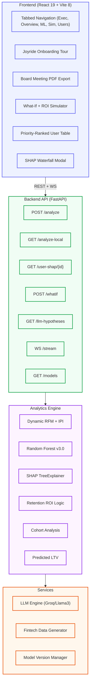

# FinSight v3.0 — Enterprise Churn Intelligence & Retention ROI

<div align="center">

> **Predict · Explain · Intervene · Protect Revenue**
>
> An enterprise-grade analytics engine that transforms raw fintech transaction data into actionable churn intelligence — with per-user SHAP explainability, counterfactual simulation, AI-generated strategy playbooks, and a real-time intervention engine.

[](https://www.python.org/)
[](https://fastapi.tiangolo.com/)
[](https://react.dev/)
[](https://vitejs.dev/)
[](https://xgboost.readthedocs.io/)
[](https://shap.readthedocs.io/)
[](https://docs.docker.com/)
[](LICENSE)
[](https://finsight-frontend-r0a8.onrender.com/)

</div>

---

## Strategic Value

| Dimension | Standard Analytics | **FinSight v3.0 (Enterprise)** |
|-----------|---------------------------|--------------------------|
| **Prediction** | Binary churn (Yes/No) | **Probability + Revenue at Risk + LTV Forecast** |
| **Segments** | Simple K-Means | **Professional Personas (e.g., "The Fading Star")** |
| **Explainability** | Static charts | **Per-user Local SHAP + Global Interaction Plots** |
| **Action** | Static recommendations | **Dynamic ROI Calculator (Profitable / Not)** |
| **Simulation** | None | **Campaign Simulator + A/B Test Engine** |
| **Reporting** | CSV Export | **"Board Meeting" PDF Export + Exec View** |
| **UX** | Dashboard | **Tabbed Interface + Interactive Onboarding Tour** |
| **Validation** | Manual | **Pydantic v2 Strict Schema + Automated Tests** |

---

## Feature Catalogue

### 1. Tabbed Intelligence Interface *(new)*
The dashboard is now organized into functional workstreams to reduce cognitive load:
- **Executive View**: High-level KPIs and Board-ready insights.
- **Overview**: Behavioral segmentation and lifecycle distribution.
- **Explainability**: Deep-dive into SHAP drivers and Model Health.
- **Simulation**: What-If counterfactuals and the Intervention Engine.
- **Users & Cohorts**: Individual risk profiles and temporal retention heatmaps.

### 2. Retention ROI Calculator *(new)*
Moves beyond "who will churn" to "who is profitable to save":
- **Dynamic Costing**: Calculates intervention cost vs. Predicted LTV.
- **Profitability Labeling**: Automatically flags users as `Profitable` or `Non-Profitable` for retention spend.
- **Revenue Protection**: Prioritizes users where `(LTV × Churn Reduction) > CAC`.

### 3. "Board Meeting" Export Engine *(updated)*
Generate executive-ready reports with one click:
- **PDF Export**: Capture the entire app state (Header + All Content) into a professional multi-page document.
- **Analytical S-Curve Forecasting**: Visualizes future churn risk vs. recovered revenue using a logistic recovery simulation grounded in the model's actual AUC precision, complete with a "No Action" baseline.
- **Product Risk Breakdown**: Identifies specific "Leaky Bucket" products (e.g., Credit Cards, Savings) for targeted optimization.
- **Strategic Recommendations**: Prescriptive C-Suite action items based on real-time ROI calculations.

### 4. Professional Persona Classification
Standardized fintech segments for intuitive business communication:
- **The Fading Star**: High-value users showing rapid frequency decline.
- **The Loyal Giant**: High-LTV, low-risk users requiring "Platinum" treatment.
- **The Hibernator**: Long-tenure users who have gone silent (High IPI Deviation).
- **The Price Shopper**: Low-monetary users sensitive to discounts.

### 5. Interactive Onboarding Tour *(new)*
Powered by `react-joyride`, a guided walkthrough introduces new users to:
- Data integration flows.
- AI explainability (SHAP) interpretation.
- Simulation engine mechanics.
- Cohort retention reading.

### 6. Per-User Local SHAP Explainability & Model Evidence
- Click any user row to render their individual SHAP waterfall.
- *"85% churn risk BECAUSE Recency pushes risk +0.187, Frequency reduces it −0.042"*
- **Global Feature Interaction**: Interactive dependence plots visualizing how intersecting variables (e.g., $Amount × Tenure$) drive churn.
- **What-If Model Evidence**: Simulation results now return "Model Evidence" bars, mapping the raw data changes back to the Random Forest's cumulative feature importance weights to prove simulation validity.

### 7. Priority Score Ranking
User table sorted by a multi-dimensional metric:
`Priority Score = Churn Prob × (LTV / Max LTV) × Engagement Sensitivity`
- Surfacing the **"Top 50 Users to Save TODAY"**.
- Real-time badges: **URGENT / HIGH / MONITOR**.

### 8. Intervention Engine & C-Suite Playbook
Prescriptive action playbook — an enterprise-grade, segment-specific, judge-ready table:
- Maps high-level strategic personas directly to targeted C-Suite Interventions (e.g., VIP Concierge, Fee Waivers).
- Tracks the specific problem driver (e.g., "High IPI Deviation") and calculates live ROI Status (e.g., "URGENT ROI" vs "PROF. GROWTH").

### 9. Automated Model Health & Data Drift Monitor
Real-time tracking of Model Health Metrics including active ROC-AUC and Cross-Validation F1-Scores. 
- A live **Data Drift Monitor** calculates statistical P-values to detect behavioral shifts, ensuring the Random Forest v3.0 model remains calibrated for high-stakes enterprise decisions.

---

## How It Works (Architecture)



---

## Tech Stack

| Layer | Technology | Purpose |
|-------|-----------|---------|
| **API** | FastAPI 0.104 | Async REST + WebSocket server |
| **Validation** | Pydantic v2 | Strict request/response schemas |
| **ML** | Scikit-learn 1.3, XGBoost 2.0 | Random Forest Churn Classification |
| **Explainability** | SHAP 0.44 | Global + local feature attribution |
| **Frontend** | React 19, Vite 8 | Tabbed SPA dashboard |
| **Onboarding** | React Joyride | Interactive user tour |
| **Reporting** | html2canvas, jsPDF | "Board Meeting" PDF generation |
| **LLM** | Groq API (Llama 3) | SHAP-linked AI hypotheses |
| **DevOps** | Docker Compose | Containerized orchestration |

---

## Getting Started

### Prerequisites
- Docker Desktop (Recommended)

### Option A — Docker (Quick Start)
```bash
git clone https://github.com/RiyanshiVerma-11/FinSight.git
cd FinSight
docker-compose up --build
```
| Service | URL |
|---------|-----|
| Dashboard | http://localhost:3000 |
| API | http://localhost:8000 |
| Documentation | http://localhost:8000/docs |

---

## Business Value

| Problem | FinSight Solution | Impact |
|---------|-----------------|-------------------|
| **Opaque Decisions** | SHAP Explainability | Auditable ML → Action chain |
| **Blind Campaigns** | ROI Calculator | Profitable vs Non-Profitable spend |
| **Hidden Churn** | Priority Score | Top 50 users to save TODAY |
| **Executive Disconnect**| Board Meeting Export | One-click C-suite reporting |
| **Complex UX** | Tabbed Interface | Reduced time-to-insight |

---

## Project Structure

```text
FinSight/
├── backend/
│   ├── main.py           # FastAPI entry point
│   ├── schemas.py        # Pydantic v2 data models
│   ├── requirements.txt  # Python dependencies
│   ├── Dockerfile        # Backend container config
│   ├── datasets/         # Pre-loaded fintech datasets
│   ├── models/           # Versioned ML model artifacts (.pkl)
│   ├── services/
│   │   ├── analytics.py     # RFM, Churn (RF), SHAP, LTV logic
│   │   ├── llm_engine.py    # Groq-powered hypothesis generator
│   │   └── data_generator.py # Real-time event stream logic
│   └── tests/            # Pytest suite (API & Analytics)
├── frontend/
│   ├── src/
│   │   ├── App.jsx          # Dashboard orchestrator & Tab logic
│   │   ├── index.css        # Design system & global styles
│   │   └── components/
│   │       ├── ExecutiveDashboard.jsx # PDF-exportable CEO view
│   │       ├── InterventionEngine.jsx # Action playbook engine
│   │       ├── WhatIfPanel.jsx      # ROI & Campaign simulator
│   │       ├── ShapModal.jsx       # User-level explainability
│   │       └── LiveTicker.jsx      # WebSocket event feed
│   ├── tests/               # Vitest & RTL component tests
│   ├── vite.config.js       # Vite build configuration
│   └── package.json         # Node.js dependencies
├── render.yaml           # Multi-service cloud deployment config
├── docker-compose.yml    # Local orchestration
└── README.md             # Project documentation
```

---

## License

MIT © 2026 Riyanshi Verma

<div align="center">

Built for Professional Fintech Partners · **FinSight v3.0**

</div>
